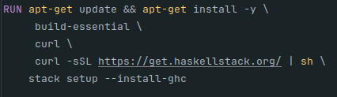
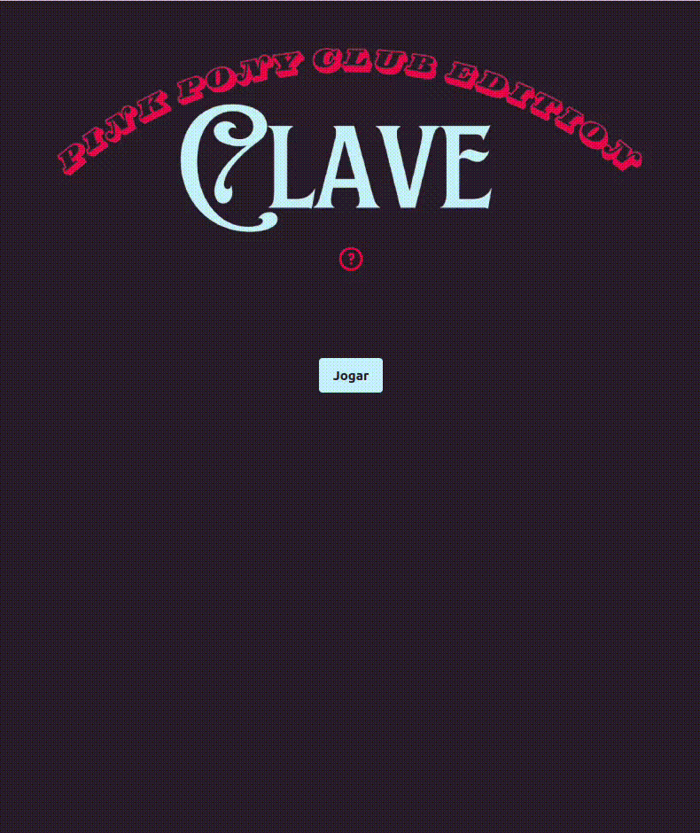

# Clave
1. **Identificação**\
Nome: Isadora Fenner Spohr\
Curso: Sistemas de Informação\

2. **Tema:** site de adivinhar a música\
Objetivo: o objetivo do meu trabalho foi produzir um site de adivinhar o nome da música a partir de um pedaço da letra, 
utilizando um back-end feito em Haskell e front-end em Vue.js.\

3. **Desenvolvimento:**\
    Para desenvolver o back-end da aplicação, utilizei a biblioteca Scotty para fazer as requisições.
Para fazer a leitura do arquivo contendo as músicas e posteriormente salvar as informações, utilizei uma série de módulos
do Haskell, sendo eles:
 - aeson [8] : para transformar a lista de objetos em json;
 - split [9]: para dividir as strings obtidas do arquivo;
 - random [10]: para gerar números pseudo-aleatórios;
 - random-shuffle [11]: utiliza o número pseudo-aleatório para embaralhar a lista de letras de música;
 - text [12]: para manipular o tipo Text utilizado pelo Scotty;
 - wai-cors [13]: para adicionar um middleware CORS que permite aceitar requisições vindas de outros sites.
    
    Utilizei a ferramenta Stack [14] para facilitar o gerenciamento de módulos e pacotes.\
    Dificuldades: inicialmente, meu objetivo era desenvolver o back-end de maneira que cada requisição retornaria apenas
uma música, ao invés da lista com todas embaralhadas. A ideia era manter a lista embaralhada apenas no back, e ir avançando
o índice quando a requisição fosse chamada. Isso, porém, faria com que o site não funcionasse corretamente em caso de mais
de um acesso simultâneo, pois poderia haver um conflito com o incremento do índice. Por isso, decidi fazer com que a requisição
enviasse a lista completa de músicas, porém sem as respostas.\
    Outra dificuldade que tive foi com o próprio paradigma funcional. Desenvolver esse projeto me ajudou a entender melhor
a forma como a linguagem funciona. Um exemplo foi a variável arquivoTxt, que criei para guardar o caminho do arquivo a ser lido.
Inicialmente, tentei declará-la dentro da função main, o que causou um ero que me levou a pesquisar mais sobre as funções do tipo IO
[1, 2].\
    Por fim, acredito que uma das minhas maiores dificuldades nesse trabalho tenha sido o Dockerfile. Foi a primeira vez que
configurei um, e tive dificuldades em entender como ele funciona e os erros encontrados. Um erro que demorei muito para entender
e corrigir foi manter o comando "stack setup" junto com os comandos iniciais:\

Essa configuração fazia com que o comando fosse executado antes das dependências necessárias serem propriamente configuradas.

No front-end utilizei o framwork Vue.js[16], Vite[17] para facilitar a construção do projeto, Axios[18] para as requisições
e TailwindCSS[19] e DaisyUI[20] para a estilização.

4.**Resultado final**\

Tela de ajuda e tela final:\

Para execução do back-end:
`stack run --allow-different-user`

Para execução do front-end:
- cd frontend 
- npm run dev

Observações:
- Caso a execução seja feita pelo Codespaces, sugiro primeiro criar o terminal e rodar o back-end, depois abrir um novo terminal
para executar o front.
- Para fins de teste, disponibilizei um arquivo "testes.txt" com apenas uma música. Para utilizá-lo, apenas substituir o valor
de arquivoTxt, na linha 47 do arquivo /src/Main.hs por "src/testes.txt" e então dar o comando stack run novamente.

5.**Referências e créditos**
   - [1] - https://www.haskell.org/tutorial/io.html;
   - [2] - https://stackoverflow.com/questions/40371572/let-and-variables-in-haskell;
   - [3] - http://seanhess.github.io/2015/08/04/practical-haskell-getting-started.html;
   - [4] - https://stackoverflow.com/questions/52019797/how-to-convert-scotty-parameter-as-string;
   - [5] - https://learnyouahaskell.com/chapters;
   - [6] - https://stackoverflow.com/questions/19594655/random-number-in-haskell;
   - [7] - https://hoogle.haskell.org/;
   - [8] - https://hackage.haskell.org/package/aeson;
   - [9] - https://hackage.haskell.org/package/split;
   - [10] - https://hackage.haskell.org/package/random;
   - [11] - https://hackage.haskell.org/package/random-shuffle;
   - [12] - https://hackage.haskell.org/package/text;
   - [13] - https://hackage.haskell.org/package/wai-cors;
   - [14] - https://docs.haskellstack.org/en/stable/;
   - [15] - https://www.reddit.com/r/haskell/comments/g1pd8q/best_way_to_parse_a_text_file/;
   - [16] - https://vuejs.org/;
   - [17] - https://vite.dev/;
   - [18] - https://axios-http.com/ptbr/docs/intro;
   - [19] - https://tailwindcss.com/;
   - [20] - https://daisyui.com/;
   - Materiais disponibilizados pela professora.
